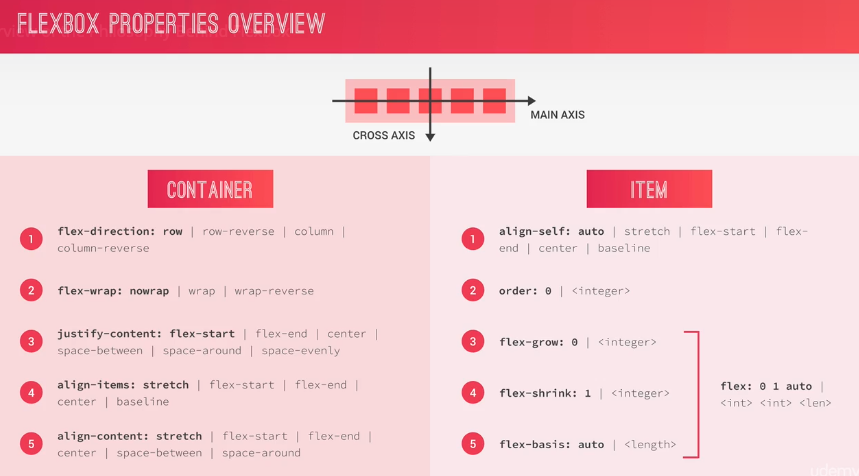

# FLEXBOX 🔥
* Flexbox is a new module in CSS3 that makes it easy to align elements to one another, in different directions and orders.
* The main idea behind flexbox is to give the container the ability to expand and to shrink elements to best use all the available space.
* Flexbox replaces float layouts, using less, and more readable and logical code.
* Flexbox completely changes the way that we build one-dimensional layouts.

## Container Properties
* flex-direction: Specifies in which direction the main axis goes.
* flex-wrap: Defines if the flex items should wrap into a new line if there is not enough space in the flex container.
* justify-content: Defines how the flex items will be aligned along the main axis.
* align-items: Defines how the flex items will be aligned along the cross axis.
* align-content: Only applies when there is more than one row of flex items.

## Item Properties
* align-self: Similar to align-items but just for one item.
* order: Defines the order in which one specific flex item should appear inside the container (Helpful for reorder items on small screens).
Three properties that together helps flexbox decide on the width of a flex item.
* flex-grow: Define how much an item can grow.
* flex-shrink: Define how much it can shrink.
* flex-basis: Defines its base width.
* flex: flex-grow - flex-shrink - flex-basis

## Cheat Sheet


## Flexbox Properties Demo
[Demo](https://codepen.io/crperz/pen/poJWRav?editors=1100)

## Notes
* SVG(Scalable Vector Graphics) icons: There are several problems with icon fonts (really it's just a hack). Screenreaders for blind people. It's considered best practice to move away from icon fonts to SVG icons. Resource for SVG icons [icomoon](https://icomoon.io).
* Make one-child in other row and then give them space-around between rows.
```css
.container {
  flex-wrap: wrap;
  align-content: space-around;
}
.one-child {
  flex: 0 0 100%;
}
```
* currentColor property: Inherit the color of the current element or the parent element.
```css
color: currentColor;
background-color: currentColor;
fill: currentColor;
```
* Apply different functions to different animations. Delay the second animation exactly the time that the first transform happen.
```css
transition: transform 0.2s,
            width 0.4s cubic-bezier(1, 0, 0, 1) 0.2s,
            background-color 0.1s;
```
* Flexbox trick: Use flexbox with margin: auto in child elements.
```css
margin: auto
.
.
.
margin-right: auto;
```
* Masks: Defines an area where we can look through the element and see what's behind that element.
```css
background-color: var(--color-primary);
mask: url(../img/icon.svg);
mask-size: cover;
```
* Box-Sizing
```css
// Border and padding to be added in the content of the element.
box-sizing: content-box;
// Includes the padding and the border into the width and height of the element.
box-sizing: border-box;
```
* Use Figure HTML tag for reviews and descriptions of the images.
```html
<figure></figure>
```
* z-index only works if you set the position.
* When an element is inline then use display: inline-block in order to use padding.
* CSS variables don't work in media queries. Use Sass variables.

## TODO
* Display some kind of user menu when hovering over the username in .user-nav.
* Display a message menu when hovering over the chat icon in .user-nav (like facebook).
* Display a box with search suggestions as soon as the user starts typing in the search field.
* Create a caption for the .gallery__item with a hover effect.
* Make the page 100% responsive even for viewport sizes below 500px.